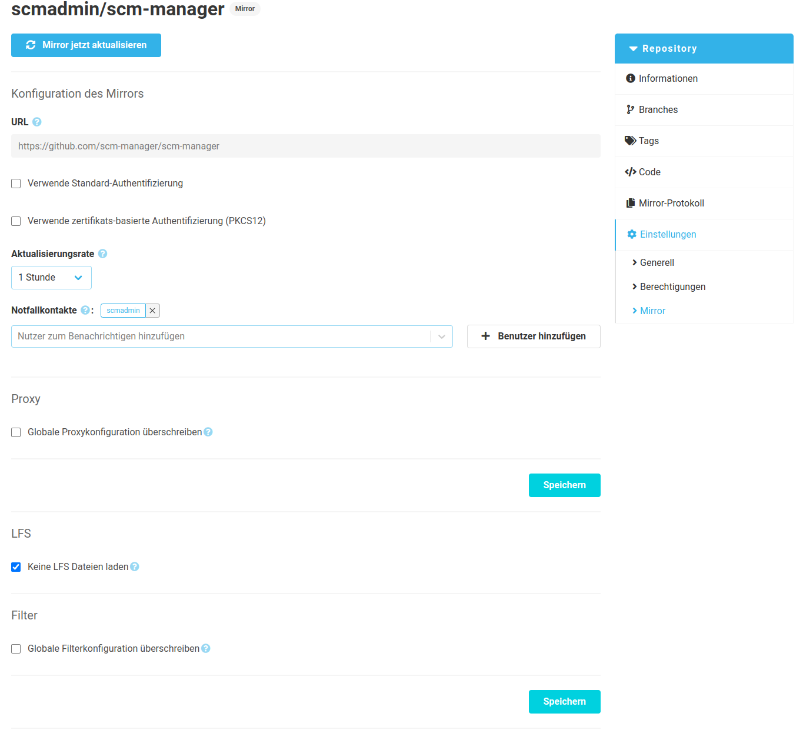
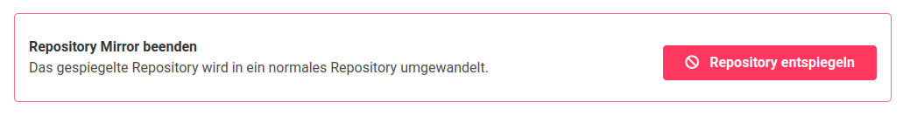
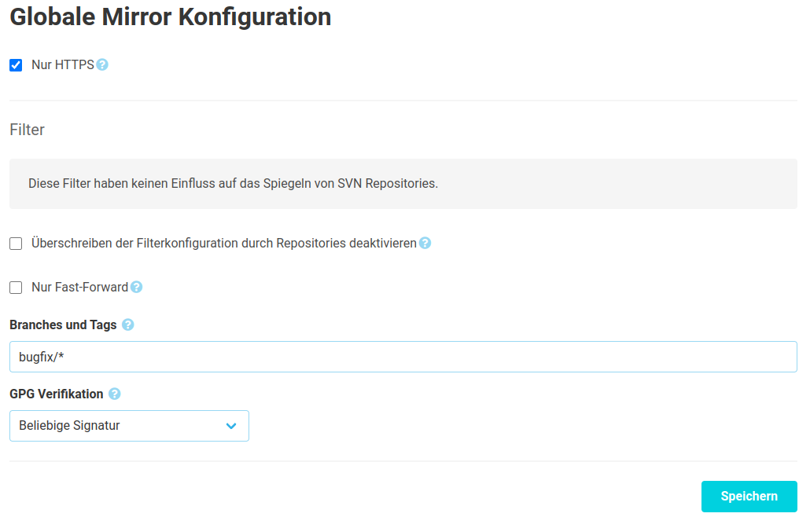

Wurde ein Repository als Mirror erstellt, gibt es eine Konfiguration dafür. 
Neben dem sofortigen Starten eines Synchronisationslaufes [^1] können hier die Zugangsdaten,
das Synchronisationsintervall sowie die Filter angepasst werden.

Zusätzlich zum Zeitpunkt der Erstellung findet sich hier eine Liste von "Notfallkontakten". Diese
Benutzer werden benachrichtigt, wenn sich der Mirror-Status ändert.

Die Details zu den anderen Einstellungen finden sich in der [Dokumentation zur Erstellung](../create).

[^1]: Es laufen grundsätzlich höchstens vier Synchronisationen gleichzeitig.

In dem rot-umrandeten Bereich unten kann über die Aktion `Repository entspiegeln` der Mirror endgültig beendet werden. 
Als Folgen daraus wird das Repository nicht mehr von der externen Quelle aktualisiert und das Repository kann direkt bearbeitet werden.
Sobald ein Mirror beendet wurde, kann dieses Repository nicht mehr in ein gespiegeltes Repository umgewandelt werden!

## Globale Konfiguration

In den Administrationseinstellungen können zusätzliche Einstellungen vorgenommen
und Standardwerte für Filter definiert werden. Außerdem kann die lokale Konfiguration
der Filter unterbunden werden.

