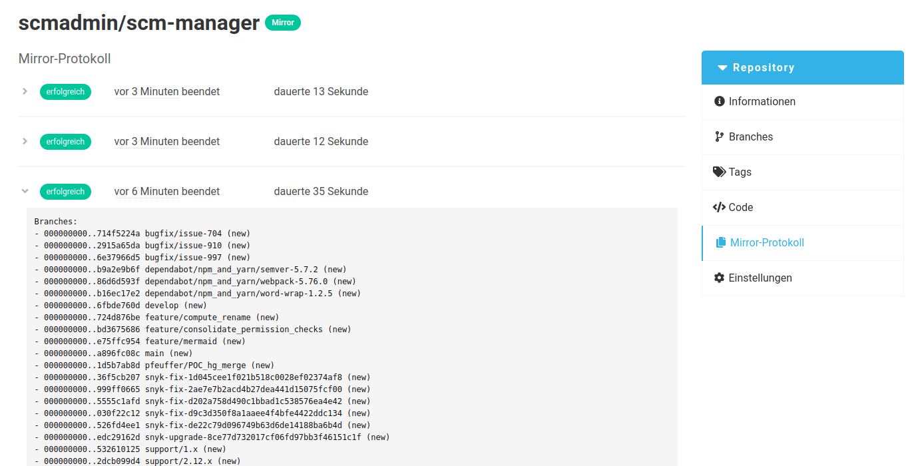

Im SCM-Manager gibt es neben dem Erstellen eines neuen Repositories 
und dem Importieren eines bestehenden Repositories noch einen dritten Modus: **Repository Spiegeln**.

Über das Formular können eine URL, mögliche Zugangsdaten und ein Synchronisierungsintervall definiert werden.
Zusätzlich werden die SCM-Manager üblichen Informationen zum neuen Repository abgefragt.

Optional gibt es verschiedene Filter (diese Filter haben keinen Einfluss auf das Spiegeln von SVN Repositories):

**Nur Fast-Forward**

Wenn dieses gewählt ist, werden Änderungen an Branches oder Tags nicht übernommen, wenn diese "forciert" wurden.

**Branches und Tags**

Wenn hier eine durch Kommata getrennte Liste an Mustern eingetragen wird, werden Branches und Tags nur
übernommen, wenn diese einem dieser Muster entsprechen, z. B. `main, develop, release/*`.
Ist hier nichts eingetragen, wird nicht nach Namen gefiltert.

**GPG Verifikation**

Es kann nach GPG signaturen gefiltert werden.
Für Branches werden die Signaturen des Commits geprüft, auf den der Branch zeigt.
Bei Tags wird deren eigene Signatur geprüft.

| Typ | Effect |
|:---:|---|
| Keine | No verification will take place |
| Beliebige Signatur | Es werden nur Branches und Tags mit einer gültigen Signatur gespiegelt. |
| Signatur eines SCM-Manager Users | Branches und Tags werden nur dann gespiegelt, wenn eine Signatur eines SCM Benutzers vorhanden ist. |
| Vorgegebene Liste | Branches und Tags werden nur dann gespiegelt, wenn sie eine Signatur für einen der angegebenen öffentlichen Schlüssel haben. |

Auf Grundlage dieser Daten wird ein neues Repository im SCM-Manager erstellt
und der Inhalt von der externen Quelle gespiegelt.

Gespiegelte Repository werden über den **Spiegel**-Tag kenntlich gemacht.
Ein grauer Tag weist auf die laufende erstmalige Synchronisation mit der externen Quelle hin.
Wurden die Daten erfolgreich synchronisiert, ist der Tag grün.
Ein roter Tag bedeutet, dass während der Synchronisation Fehler aufgetreten sind.
Wurden Branches oder Tags aufgrund eines konfigurierten Filters (mit Ausnahme der Muster für Namen) nicht
übernommen, ist der Tag gelb.

Die Einstellungen zur Spiegelung wie Zugangsdaten, Synchronisationsintervall und Filter können auch nachträglich
über das entsprechende [Einstellungsmenü](../config) im Repository angepasst werden. Zu beachten ist, dass die
URL **nicht mehr** geändert werden kann.

Die Ergebnisse der Synchronisation können in dem "Protokoll der Spiegelung" in der Navigation für das
Repository eingesehen werden.

