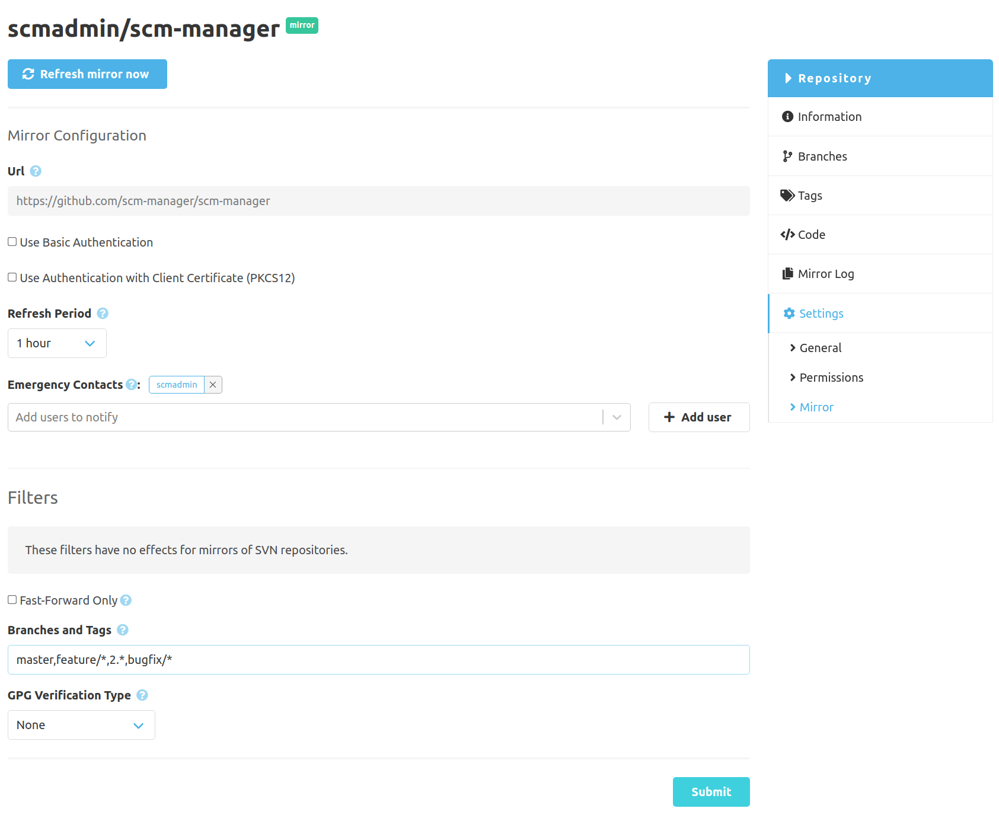
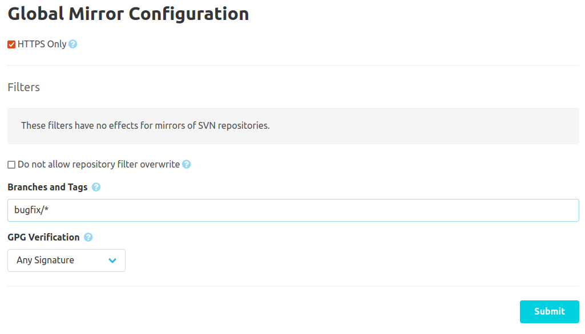

If a repository was created as a mirror, there is a mirror configuration.
Besides the possibility to trigger an immediate synchronization [^1] of the repository the credentials,
the synchronization interval, and the filters can be changed with this dialog.

Additional to the time of the creation there is a configuration for "Emergency Contacts". These are
users who will get a notification whenever the status of a mirror synchronization has changed.

The details for the other settings can be found in the [documentation for the creation](../create).

[^1]: Please note, that at most four synchronisations will run in parallel.

## Global Configuration

Further settings are available in the administration settings and default filters can
be defined. Additionally, local filter configuration can be disabled.

