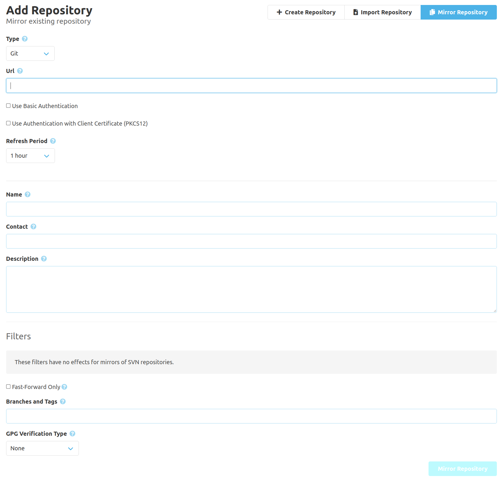
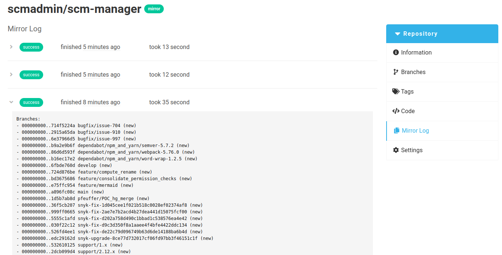

In addition to creating a new repository and importing an existing repository, SCM Manager offers a third mode: **Mirror Repository**.

The form can be used to define a URL, optional credentials and a synchronization interval.
Below this, there are SCM Manager's usual information for the new repository.

Optionally, there are different filters available (these filters have no effect on SVN repositories):

**Fast-Forward only**

If selected, changes on branches and tags will be rejected when they have been forced.

**Branches and Tags**

If given, only branches and tags matching the given patterns (devided by commas) will be synchronized, eg. `main, develop, release/*`. If nothing is specified, branches and tags will not be filtered by name.

**GPG Verification**

This can verify GPG signatures for branches and tags. For branches, the signature of the commit this branch points to will be checked, for tags this will check the signatures of the tag itself.

| Type | Effect |
|:---:|---|
| None | No verification will take place |
| Any Signature | Only branches and tags with a valid signature will be mirrored. |
| SCM User Signature | Branches and tags will only be mirrored, if they have a signature matching a public key of an SCM user. |
| Pre-defined Key List | Branches and tags will only be mirrored, if they have a signature matching one of the given public keys. |

Based on this data, SCM-Manager creates a new repository, and fetches the content from the external source.

Mirrored repositories are marked with a **Mirror** tag.
A gray tag indicates the ongoing first synchronization with the external source.
If the data synchronization was successful, the tag is green.
A red tag indicates errors during the synchronization.
If branches or tags were rejected due to a configured filter (other than the name patterns),
it is yellow.

The mirror settings like credentials, synchronization interval, and filters can also be changed later
using the corresponding [settings](../config) menu in the repository. The source URL **cannot** be changed after the creation.

The synchronization results can be found in the "Mirror Log" in the navigation for the repository.

